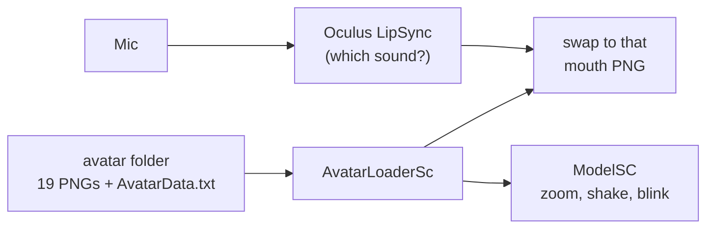

# Emil's Lipsync

A little app that lets you become a vtuber really quickly with just a bunch of PNGs. You draw your avatar's mouth for each sound, point the app at the folder, and it swaps the mouth in real time while you talk into your mic. That's it, no 3D model, no face tracking.

**Just want to use it? Grab it for free on Gumroad: [emilswork.gumroad.com/l/Lipsync](https://emilswork.gumroad.com/l/Lipsync)**. This repo is the Unity source.

It uses full visemes (15 mouth shapes, not just "open/closed"), so the mouth actually follows what you say instead of flapping around. The heavy lifting (listening to the mic and figuring out which sound you're making) is done by Meta's Oculus LipSync, I built the app around it: the avatar loader, the setup wizard, blinking, the little shake, settings, all that.

## Making an avatar

An avatar is just a folder with these PNGs in it, names have to match exactly:

| Files | What |
|---|---|
| `sil` | mouth when you're silent |
| `pp` `ff` `th` `dd` `kk` `ch` `ss` `nn` `rr` | consonant mouths |
| `aa` `e` `i` `o` `u` | vowel mouths |
| `face` | the face without a mouth |
| `face-close` | the face with eyes closed, for blinking |
| `body` | the body |
| `background` | the background |

So 19 images. Then in the app you open the wizard, paste the folder path, and it checks everything is there (it yells at you if a name is wrong or something isn't a PNG). You get a preview and sliders for camera zoom, background zoom and avatar zoom, plus face shake / body shake, blink duration, blink interval and random blinking. Hit finish and it writes an `AvatarData.txt` next to your images, the avatar goes in your list and you can load it whenever.

In the settings there's mic selection, gain, smoothing, a target FPS, and a HQ images toggle. Everything gets saved so you don't redo it every time.



## Setup (for the source)

Unity **2021.3.20f1** with URP.

Oculus LipSync isn't in this repo, its license doesn't let me redistribute it, so you have to get it yourself:

1. Download **Oculus Lipsync for Unity** from Meta's developer site (search "Oculus Lipsync Unity").
2. Import it so it lands in `Assets/Oculus/LipSync`.
3. Open `Assets/Scenes/SampleScene.unity`.

Without it the project won't compile, the scripts talk to `OVRLipSyncContext`, `OVRLipSyncMicInput` and `OVRLipSyncContextTextureFlip` directly.

The file browser is [Simple File Browser](https://github.com/yasirkula/UnitySimpleFileBrowser) by yasirkula (MIT), that one's included.

## Where stuff is

```
Assets/Scripts/
├── FileManagement/   loading avatars, the wizard, the saved avatar list
├── model/            the avatar itself: zoom, blink, shake
└── UI/               settings, tabs, little UI helpers
```

Heads up, this source is the **1.1.2** project. The build on Gumroad is 1.1.3, so it might be a tiny bit ahead of what's here.

Honestly it's a bit rough in places xD but it works, so hey :>

## License

MIT for my code and art, see [LICENSE](LICENSE). Third-party stuff keeps its own license (listed in there too).
